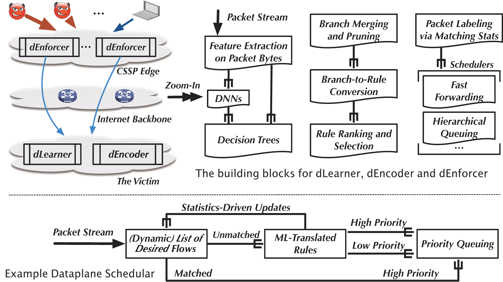

# Effective DDoS Mitigation via Preference-Driven In-network Traffic Shaping



## Introduction

DFNet is the DDoS prevention system in the proposed new paradigm that copes with the existing challenges. We design DFnet with three tightly coupled components named as dLearner, dEncoder, and dEnforcer. This anonymous repository shows part source code including the ML model architecture and dataplane implementation. 

## Requirements

Hardware:
- 40 GbE NIC: [DPDK-supported hardwares](https://core.dpdk.org/supported/)
  - e.g., Intel XL710-QDA2

Software:
- Ubuntu 16.04.1 LTS
- Python 3.7
- [DPDK 20.11](http://git.dpdk.org/dpdk-stable/tag/?h=v20.11)
- Pktgen 20.03.0

## ML Model

- Input: Extract raw bytes of the PCAP traffic and save them as CSV files. 
- Config: Modify the model parameters and dataset path in ./model/config.json. 
- Training model: Directly train decision trees, or convert the trained DNN into decision trees. 
- Generating rules: Use ./model/tree_to_rule.py to generate byte-rules from the decision tree model. 

## Dataplane

- Install DPDK 20.11 following [Getting Started Guide for Linux](https://doc.dpdk.org/guides-20.11/linux_gsg/index.html).
- Compile DPDK applications.
- Install byte-rules
	```
	./dpdk-ip_pipeline -l 0-7 -- -s ./demo_rule.cli
	```
- Use pdump to capture packets
	```
	./dpdk-pdump -- --pdump 'port=0,queue=*,rx-dev=/tmp/rx.pcap,tx-dev=/tmp/tx.pcap,ring-size=65536' --pdump 'port=1,queue=*,rx-dev=/tmp/rx2.pcap,ring-size=65536'
	```
- Use Pktgen to send packets
	```
	./pktgen -l 0-4 -n 4 -- -P -m [1].0 -m [2].1 -m [3].2 -m [4].3 -s 0:./demo.pcap -s 1:./demo.pcap -s 2:./demo.pcap -s 3:./demo.pcap
	```

